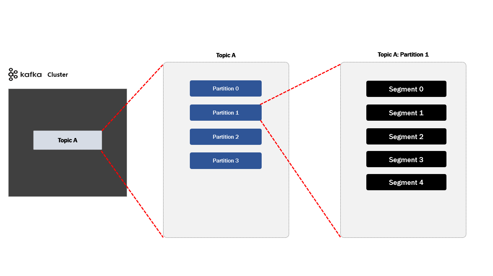

# Kafka 알아보기

## 로컬 환경 실행 방법

### Skill & Tools - Backend
- Java 17
- Spring boot 3.5.0
- JPA
- Mysql 9.x
- docker
- zookeeper
- kafka
- kafka-ui

### Service Endpoint

- order-service (주문 서비스)
  - http://localhost:8080

- catalog-service (상품 서비스)
  - http://localhost:{랜덤}

### FrontEnd Service Endpoint
- 게시판 글 등록하기
  - GET http://localhost:8080/?title=제목TEST&content=내용TEST

### Server Execution
```
// 1. 해당 프로젝트 루트 디렉토리 까지 이동 합니다. 

// 2. docker-compose 를 실행 합니다.
docker-compose up -d
```

## Kafka 주요 구성 요소


- Topic: Kafka 안에서 메시지가 저장되는 장소 (논리적인 표현)
- Producer : 메시지를 생산(Produce) 해서 Kafka 의 `Topic` 으로 메시지를 보내는 애플리케이션
- Consumer : `Topic` 의 메시지를 가저와서 소비(Consume) 하는 애플리케이션
- Consumer Group : `Topic` 의 메시지를 사용하기 위해 협력하는 `Consumer` 들의 집합 

 하나의 `Consumer` 는 하나의 `Consumer Group` 에 포함되며, `Consumer Group` 내의 `Consumer` 들은 협력하여 `Topic` 의 메시지를 분산 병렬 처리함

### Kafka 기본 동작 방식 - `Producer` 와 `Consumer` 는 `Decoupling` 되어 있다.


- 각각 `Producer` 와 `Consumer` 는 서로 알지 못하며 (알 필요도 없음), `Producer` 와 `Consumer` 는 각자 고유의 속도로 `Commit Log` 에 `Write` 및 `Read` 를 수행 합니다.
- 다른 `Consumer Group` 에 속한 `Consumer` 들은 서로 관련이 없으며, `Commit Log` 에 있는 `Event(Message)` 를 동시에 다른 위치에서 `Read` 할 수 있습니다.

### Kafka 기본 동작 방식 - `Kafka Commit Log` 는 추가만 가능하고 변경 불가능한 데이터 스트럭처


- Commit Log : 추가만 가능하고 변경 불가능한 데이터 스트럭처 데이터(Event)는 항상 로그 끝에 추가되고 변경되지 않습니다.
- Offset : `Commit Log` 의 `Event` 위치 
- CUREENT-OFFSET: `Consumer` 가 지금 현재 내가 어디까지 읽었는지 나타내는 용어
- LOG-END-OFFSET: `Producer` 가 지금 현재 어디까지 쓰기 를 했는지 나타내는 용어
- Consumer Lag: `CUREENT-OFFSET` 하고 `LOG-END-OFFSET` 차이

### Kafka 논리적 표현 - `Topic`, `Partition`, `Segment`



- Topic : Kafka 안에서 메시지가 저장되는 장소, 논리적인 표현
- Partition : `Commit Log`, 하나의 `Topic`은 하나 이상의 `Partition`으로 구성
- 병렬처리(Throughput 향상)를 위해서 Multi Partition 사용 권장
- Segment : 메시지(데이터)가 저장되는 실제 물리 File `Segment File`이 지정된 크기보다 크거나 지정된 기간보다 오래되면 새 파일이 열리고 메시지는 새 파일에 추가됨

### Kafka 물리적 표현 - `Topic`, `Partition`, `Segment`


- `Topic` 생성시 `Partition` 수를 Custom 해서 설정 할 수 있습니다. 
- `Topic` 으로 구성 된 각각의 `Partition` 은 `Broker` 들에 분산되며 `Segment File` 들로 저장 및 구성 하게 됩니다.
- `Topic` 생성시 `Kafka` 가 자동으로 `Topic`을 구성하는 전체 `Partition`들을 모든 `Broker`에게 할당해주고 분배 해줍니다.
- 각각의 `Topic` 은 `Partition` 들을 서로 독립적 입니다.
- `Partition` 내에 저장된 `Message (데이터)` 는 수정이 불가능 합니다.
- `Offset` 값은 처음에 0 부터 시작 되며 다시 0 으로 돌아가지 않습니다.


### Kafka Serializer & Deserializer


- `Kafka` 는 Record(데이터) 를 `Byte Array` 형식으로 저장 됩니다.
- `Producer` 는 `Serializer` 사용하고 반대로 `Consumer` 는 `Deserializer` 를 사용하게 됩니다.

```markdown
    @Bean
    @Primary
    public ProducerFactory<String, Object> producerFactory(KafkaProperties kafkaProperties) {
        Map<String, Object> props = new HashMap<>();
        props.put(ProducerConfig.BOOTSTRAP_SERVERS_CONFIG, kafkaProperties.getBootstrapServers());
        props.put(ProducerConfig.KEY_SERIALIZER_CLASS_CONFIG, StringSerializer.class);
        props.put(ProducerConfig.VALUE_SERIALIZER_CLASS_CONFIG, StringSerializer.class);
        props.put(ProducerConfig.ACKS_CONFIG, "-1");
        props.put(ProducerConfig.ENABLE_IDEMPOTENCE_CONFIG, "true");
        return new DefaultKafkaProducerFactory<>(props);
    }

    @Bean
    @Primary
    public ConsumerFactory<String, Object> consumerFactory(KafkaProperties kafkaProperties) {
        Map<String, Object> props = new HashMap<>();
        props.put(ConsumerConfig.BOOTSTRAP_SERVERS_CONFIG, kafkaProperties.getBootstrapServers());
        props.put(ConsumerConfig.KEY_DESERIALIZER_CLASS_CONFIG, StringDeserializer.class);
        props.put(ConsumerConfig.VALUE_DESERIALIZER_CLASS_CONFIG, StringDeserializer.class);
        props.put(ConsumerConfig.ALLOW_AUTO_CREATE_TOPICS_CONFIG, "true");
        props.put(ConsumerConfig.ENABLE_AUTO_COMMIT_CONFIG, "false");
        return new DefaultKafkaConsumerFactory<>(props);
    }
```

### Kafka Producer Application 내부 동작


우선 `Producer Application` 내에 전송 하고자 하는 `Producer Record` 데이터를 만듭니다. `Send()` 를 하게 된다면 `Serializer` 에서 미리 지정한 어떤 데이터 형식으로 Serializer 할 것인지 변환 되고 이전에 `Send()` 할때 `Partition` 을 지정을 했다면 어떤 파티션에 저장 할 것인지 지정을 하게 됩니다.

그리고 `Compress` 압축을 할 것인지 선택하게 되고 `RecordAccumulator` 이라는 곳 에서 미리 지정했던 `Partition` 0 번으로 보낼 것인지 1 번으로 보낼 것 인지 에 따라 해당 되는 `Partition` 에 가서 데이터을 모아서 실질적으로 카프카 서버에 전송 하게 됩니다.

카프카로 부터 응답이 오는데 성공적으로 저장 되었는지 아니면 실패 했는지에 따라 실패를 했다고 `재시도` 설정에 따라 다시 시도 하게 되고 성공이면 성공에 대한 응답을 하게 됩니다.


`Producer Application` 내에 `Producer Record` 데이터를 만들고 카프카 서버로 전송시 `Partition Key` 값을 지정 하고 전송시 `Partitioner` 에서는 Hash 알고리즘으로 어떤 `Partition` 으로 보낼지 값을 계산해서 카프카에 전송 하게 됩니다.


### Kafka Consumer Offset 알아보기

`Consumer Offset` 이란 지금까지 `Consumer Group` 에서 읽은 위치를 마크 한 Offset 을 말합니다. 즉 특정 `Consumer` 에서 해당 `Offset` 을 읽었다고 하면 수동이나 자동으로 데이터를 읽은 위치를 `commit` 해서 다시 읽음을 방지 하게 됩니다. 

`__ consumer_offsets` 라는 `Internal Topic`에서 `Consumer Offset`을 저장하여 관리 합니다.


### 멀티 Partition 과 Consumer 관계


3개의 `Partition` 으로 구성된 `Topic A`를 데이터를 사용하는 단 1개의 `Consumer`가 있는 경우 해당 `Consumer` 는 Topic 의 모든 `Partition` 에서 모든 `Record` 를 `Consume` 하게 됩니다.


- 동일한 `group 아이디` 로 구성된 각각의 `Consumer` 들은 하나의 `Consumer Group` 을 형성 하게 됩니다.
- 만약 3개의 파티션이 존재하고 있는 `Topic A` 있다고 하면 `consume` 하는 `3개의 Consumer` 가 하나의 `Consumer Group (Group B)`에 있다면, 각 `Consumer` 는 정확히 하나의 `Partition`에서 `Record`를 `onsume` 하게 됩니다.
- (중요!!) `Partition`은 항상 `Consumer Group` 내의 하나의 `Consumer` 에 의해서만 사용 됩니다.
- `Consumer` 는 주어진 `Topic` 에서 0개 이상의 많은 `Partition` 을 사용할 수 있습니다.

### Kafka Message Ordering (순서)


- `Partition` 이 2개 이상일 경우 메시지 순서는 보장은 못 합니다. 만약 `Partition` 이 1개 일 경우는 순서는 보장 받을 수 있겠지만 처리량이 저하 될 수 있습니다.
- `Partition` 2개 이상으로 순서 보장을 받고 싶으면 (유저 별로) 유저 식별자키 값을 이용해서 `Partition Key` 값을 만든 다음에 순서 보장 받아야 합니다.

### Consumer Failure


3개의 `Partition`이 있는 `Topic` 을 하나의 `Consumer Group` 내에 `consume` 하는 3 개의 `Consumer`가 존재 한다고 가정 하겠습니다. 각 `Consumer` 는 정확히 하나의 `Partition` 에서 `Record` 를 `consume` 하고 있습니다.

참고로 `Partition`은 항상 `Consumer Group` 내의 하나의 `Consumer` 에 의해서만 사용됩니다. 여기서 `Consumer 3` 번이 서버가 불능 상태가 빠지게 된다면 Kafka 내에서 `Rebalancing(리밸런시)` 한 다음에 `Consumer 2` 번이 대신 처리 하게 됩니다.

### Broker Replication 기능


`Producer` 와 `Consumer` 는 `Leader Partition` 만 통신 하게 됩니다. `Follower Partition` 는 복제만 역활 하게 됩니다.  즉 `Follower Partition` 는 `Broker` 장애시 안정성을 제공하기 위해서만 존재 합니다.

그리고 `Follower Partition` 는 `Leader Partition` 의 `Commit Log` 에서 데이터를 가져 오기 `요청(Fetch Request)` 으로 복제 통해 동기화 하게 됩니다.


만약 기존 `Leader Partition` 장애 발생시 `Kafka Controller` 인해서 `Follower Partition` 이 `Leader Partition` 으로 승격 처리 됩니다. 이후 `Producer` 는 새로 선출 된 `Leader` 에게만 `Write` 하고 `Consumer` 또한 `Leader` 로부터만 `Read` 하게 됩니다.


### In-Sync Replicas (ISR)


`In-Sync Replicas (ISR)`는 High `Water Mark` 지점까지 동일한 Replicas (Leader와 Follower 모두)의 목록을 지칭 합니다. 즉 `Leader` 장애 발생시 새로운 `Leader` 선출 하는데 사용 됩니다. 

만약 `Leader` 쪽에 장애가 발생 된다고 하면 ISR 중 하나가 `Leader` 로 선출 한다.


### Producer Acks 전략 

Kafka Producer 의 `acks` 설정은 `message` 가 `Brober` 에 잘 전송 되었는지 확인 하는 방식 으로 데이터의 안전성과 성능을 조절 하는 데 사용 됩니다.

#### Acks=0


`Producer` 는 `Broker`의 응답을 기다리지 않으며 메시지 전송이 즉시 완료된 것으로 간주 합니다. 데이터 손실 가능성이 가장 높지만 가장 높은 전송 속도를 제공 합니다. (보통 이 방식은 사용 되지 않음)

#### Acks=1


`Producer` 는 `Broker Leader Partition` 에게 메시지가 저장 되었 다는 응답을 기다리게 됩니다. `Broker Leader Partition`에 메시지가 저장 되었으므로 데이터 손실 가능성이 낮지만, `Leader Partition`이 실패하면 데이터가 유실될 가능성이 있습니다.

#### Acks=-1 or all


`Producer`는 `Broker Leader Partition` 과 모든 `Broker Follower Partition`가 저장 되었다는 응답을 기다립니다. (모두 `Commit` 이 완료 되면) 데이터 손실 가능성이 가장 낮지만 가장 낮은 전송 속도를 제공합니다.


## 메시지 전달 보장 (Message Delivery Guarantees) 수준에 대해 고려

### At most once (최대 한 번)
메세지가 딱 한번만 전송 됩니다. `Producer` 에서 `Kafka broker` 에게 메시지 전송 후 만약 `broker` 으로부터 `응답 확인 (Ack)`을 받지 못 하더라도 다시 재전송을 하지 않습니다.
중복 방지를 할 수 있겠지만 만약 네트워크 문제로 메시지를 정상적으로 `broker` 로 전송 하지 못 할 경우 데이터 유실이 발생 할 수 있습니다.

### At least once (최소 한 번)
메시지 유실을 허용 하지 않는 전략 으로써 만약 `Producer` 에서 `Kafka broker` 에게 메시지 전송 후 `broker` 으로 부터 `응답 확인 (Ack)` 데이터를 받지 못하면 다시 재 전송을 하게 됩니다.

이때 `broker` 가 정상적으로 메시지를 받았지만 저장을 못해서 발생된 문제인지 아니면 메시지 조차 못 받았는지 `Producer` 입장 으로 확인 할 수 없어 다시 메시지를 전송 하게 됩니다.

이런 점을 보았을때 `At least once (최소 한 번)` 는 메시지 유실에 대한 방지에 목적을 두었지만 상황에 따라 메시지 중복은 발생 할 수 있습니다.

### Exactly once (정확히 한 번)

정확히 한번에 처리 하는 방식 이라고 생각 하면 됩니다. 즉 단 한번 으로 메시지 유실도 없고, 중복 메시지도 발생 하지 않으면서 처리 하는 방식 인데요.
이러한 두가지 조건을 만족 하기 위해서는 `ECO 시스템`이 필요 합니다. `Producer` 가 `Kafka broker` 에게 메시지 발생시 `Producer ID + 시퀀스 넘버 (유니크 키)` 값 함께 전송 하게 됩니다.
만약 중복 메시지가 전송 된다면 동일한 `Producer ID + 시퀀스 넘버` 값이 전송 하게 될테고 중복 으로 확인 된다면 처리 하지 않도록 합니다.

반대로 메시지 발행 후 `Producer` 으로 응답 확인 `Ack` 값이 전송 하지 않으시 (처음 broker 로 메시지 도착 조차 안했을 경우) 다시 재전송 해서 처리 하게 됩니다.

### Exactly Once Semantics (EOS) 이용 해서 멱등성 보장 하기


### 메시지 이벤트 이용시 `Transaction OutBox Pattern` 함께 알아보기


`Producer` 에서 `Kafka` 로 메시지 발생시 동시에 `database` 에 있는 특정 데이터를 `Insert` 및 `Update` 처리 하고 메시지 발행 해야 하는 경우가 많이 발생 됩니다.

만약 DB 에 있는 데이터를 `Insert` 및 `Update` 처리 완료 하고 메시지 발행시 실패 한다면 어떻게 될까요?

반대로 DB 에 있는 데이터를 `Insert` 및 `Update` 처리는 실패 했지만 메시지 발행이 성공 되었다면 데이터 `일관성` 문제가 발생 됩니다. (메시지 발행은 `Rollback` 이 불가능 하다.)

이때 해결하고자 `Transaction OutBox Pattern` 도입 하게 됩니다.


`Transactional Outbox Pattern` 경우 메시지 큐에 발행할 이벤트 메시지 내용을 `outbox 테이블`에 저장 하고 `Transaction 영역`에 포함 하도록 합니다.

만약 이후 `DB Insert/Update` 처리 및 `메시지 발행에 필요한 outbox 테이블 Insert` 처리가 하나 라도 실패할 경우 

1. `DB Insert/Update` 처리  
2. `메시지 발행에 필요한 outbox 테이블 Insert` 처리

`Rollback` 이 되고 결국 메시지 발행은 하지 않도록 합니다.

만약 성공 할때는 안전 하게 `메시지 발행에 필요한 outbox 테이블 Insert` 처리가 되면 주기적으로 DB 의 `outbox` 테이블에서 전송되지 않은 이벤트 메시지들을 조회해서 메시지 큐에 전송 하게 됩니다.


### Consumer Service 에서 `Retry Queue` 와 `DLQ (Dead Letter Queue)` 알아보기 

.png)

#### 재시도 할때 고려 해야 할 상황들

- 재시도 제한 횟수 (Retry Limited Count)
- 지수 백오프 (Exponential Backoff)
- 지터 (Jitter)

##### 재시도 제한 횟수
재시도 제한 횟수는 말그대로 에러 발생시 `재시도`를 몇 회 다시 시도 할 것 인가 입니다.

##### 지수 백오프
`지수 백오프`는 `재시도`와 `재시도 간격`은 얼마나 해야 할까 입니다. 지수 백오프 사이에 시간 간격이 너무 짧으면 서버 과 부하로 이어 집니다.
그래서 예시로 1회 재시도 시 간격을 1초로 했다면 2회 재시도 시 에는 간격을 2초로 이렇게 설정 하도록 합니다.

##### jitter
요청이 동시에 재시도 되지 않도록 `지수 백오프 (Exponential Backoff)` 외에 무작위 지연을 추가적 으로 부여 하는 것 입니다.

```markdown
private BackOff generateBackOff() {

    long backOffInitialInterval = 1000; # 재시도 사이의 초기 대기 시간(밀리초 단위)을 지정
    double backOffMultipler =  2; # 재시도 사이의 대기시간 배수를 지정
    int maxAtttempts = 3; # 재시도 하는 횟수

    ExponentialBackOff backOff = new ExponentialBackOff(backOffInitialInterval, backOffMultipler);
    backOff.setMaxAttempts(maxAtttempts);
    return backOff;
}
```

#### DLQ (Dead Letter Queue)

메시지 처리 작업 에서 중요 한 것은 실패는 허용될 수 있지만 누락은 결코 발생 해서는 안됩니다.

만약 재시도 횟수 초과로 인해 더 이상 `Consumer` 에서 처리 할 수 없는 상황이 발생 되면 `DLQ (Dead Letter Queue)` 에 보관 하도록 하고 나중에 개발자가 후속 처리를 할 수 있도록 해야 합니다.


### 실전 Kafka 사용해보기


`zookeeper` 1대, `kafka broker` 3대를 이용 해서 `Kafka Cluster` 를 구성 하고 `Producer` 1대 서버 및 `Consumer` 서버 2대를 이용 해서 `Kafka` 와 통신 하도록 합니다.

`Topic` 은 `board` 로 만들고 `partition` 은 3개 그리고 `Replication Factor` 를 3개로 합니다.

